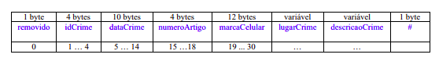

# Trabalho Introdutório
Este trabalho tem como objetivo obter dados de um arquivo de entrada e gerar um arquivo binário com esses dados. Ele é um trabalho introdutório, de forma que será usado como base para o desenvolvimento de todos os demais trabalhos da disciplina.

## Descrição do Arquivo de Dados

### Registro de Cabeçalho:

O registro de cabeçalho deve conter os seguintes campos:

• status: indica a consistência do arquivo de dados, devido à queda de energia, travamento do programa, etc. Pode assumir os valores ‘0’, para indicar que o arquivo de dados está inconsistente, ou ‘1’, para indicar que o arquivo de dados está consistente. Ao se abrir um arquivo para escrita, seu status deve ser ‘0’ e, ao finalizar o uso desse arquivo, seu status deve ser ‘1’ – tamanho: string de 1 byte.

• proxByteOffset: armazena o valor do próximo byte offset disponível. Deve ser iniciado com o valor ‘0’ e deve ser alterado sempre que necessário – tamanho: inteiro de 8 bytes.

• nroRegArq: armazena o número de registros presentes no arquivo, incluindo registros logicamente marcados como removidos. Deve ser iniciado com o valor ‘0’ e deve ser incrementado quando necessário – tamanho: inteiro de 4 bytes.

• nroRegRem: armazena o número de registros logicamente marcados como removidos. Deve ser iniciado com o valor ‘0’ e deve ser incrementado quando necessário – tamanho: inteiro de 4 bytes.

**Observações importantes**
• O registro de cabeçalho deve seguir estritamente a ordem definida na sua
representação gráfica.
• Os campos são de tamanho fixo. Portanto, os valores que forem armazenados
não devem ser finalizados por '\0'.
• Neste projeto, o conceito de página de disco não está sendo considerado. 

### Registro de Dados

Os registros de dados são de tamanho variável, com campos de tamanho fixo e campos de tamanho variável. Para os registros e os campos de tamanho variável, deve ser usado o método delimitador entre campos. O delimitador de registro é o caractere ‘#’ e o delimitador de campo é o caractere ‘|’.

Os campos de tamanho fixo são definidos da seguinte forma:

• idCrime: código identificador do crime – inteiro – tamanho: 4 bytes.

• dataCrime: data da ocorrência do crime no formato DD/MM/AAAA – string –
tamanho: 10 bytes.

• numeroArtigo: número do artigo no código penal que corresponda ao crime
ocorrido – inteiro – tamanho: 4 bytes.

• marcaCelular: marca do celular que foi furtado/roubado, caso a ocorrência tenha
relação com um desses crimes – string – tamanho: 12 bytes

Os campos de tamanho variável são definidos da seguinte forma:

• lugarCrime: lugar no qual o crime ocorreu – string

• descricaoCrime: descrição detalhada do crime – string

Adicionalmente, o seguinte campo de tamanho fixo também compõe cada registro. Esse campo é necessário para o gerenciamento de registros logicamente removidos. 

• removido: indica se o registro está logicamente removido. Pode assumir os valores ‘1’, para indicar que o registro está marcado como logicamente removido, ou ‘0’, para indicar que o registro não está marcado como removido. – string – tamanho: 1 byte

## Funções do Programa

### CREATE TABLE
Na linguagem SQL, o comando CREATE TABLE é usado para criar uma tabela, a qual é implementada como um arquivo. Geralmente, uma tabela possui um nome (que corresponde ao nome do arquivo) e várias colunas, as quais correspondem aos campos dos registros do arquivo de dados. A funcionalidade a seguir representa um exemplo de implementação do comando CREATE TABLE. 

A função Ppermite a leitura de vários registros obtidos a partir de um arquivo de entrada no formato csv e a gravação desses registros em um arquivo de dados de saída. O arquivo de entrada no formato csv é fornecido juntamente com a especificação do projeto, enquanto o arquivo de dados de saída deve ser gerado de acordo com as especificações deste trabalho prático. Antes de terminar a execução da funcionalidade, deve ser utilizada a função binarioNaTela, disponibilizada na página do projeto da disciplina, para mostrar a saída do arquivo binário.

### SELECT
Na linguagem SQL, o comando SELECT é usado para listar os dados de uma tabela. Existem várias cláusulas que compõem o comando SELECT. O comando mais básico consiste em especificar as cláusulas SELECT e FROM, da seguinte forma: 

    SELECT lista de colunas (ou seja, campos a serem exibidos na resposta)
    FROM tabela (ou seja, arquivo que contém os campos)

Essa funcionalidade representa um exemplo de implementação do comando SELECT. Como todos os registros devem ser recuperados nessa funcionalidade, sua implementação consiste em percorrer sequencialmente o arquivo. A funcionalidade permite a recuperação dos dados de todos os registros armazenados em um arquivo de dados de entrada, mostrando os dados de forma organizada na saída padrão para permitir a distinção dos campos e registros. O tratamento de ‘lixo’ deve ser feito de forma a permitir a exibição apropriada dos dados. Registros marcados como logicamente removidos não devem ser exibidos.