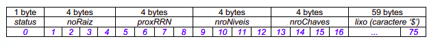
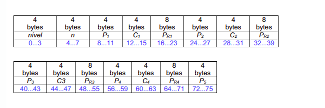

# TRABALHO 2: ÁRVORE B*
No trabalho é usado o conceito de páginas de disco, desde que cada nó da árvore-B* é do tamanho de uma página de disco. Cada página de disco tem o tamanho fixo de 76 bytes. O conceito de página de disco é um conceito lógico, ou seja, deve ser garantido via programação, de forma que cada página de disco contenha, no máximo, o tamanho fixo especificado. https://pt.wikipedia.org/wiki/%C3%81rvore_B* 

## Descrição do Arquivo de Dados

### Cabeçalho
O registro de cabeçalho deve conter os seguintes campos:

• status: indica a consistência do arquivo de índice árvore-B*, devido à queda de energia, travamento do programa, etc. Pode assumir os valores 0, para indicar que o arquivo de dados está inconsistente, ou 1, para indicar que o arquivo de dados está consistente. Ao se abrir um arquivo para escrita, seu status deve ser 0 e, ao finalizar o uso desse arquivo, seu status deve ser 1 – tamanho: string de 1 byte.

• noRaiz: armazena o RRN do nó (página) raiz do índice árvore-B*. Quando a árvore-B* está vazia, noRaiz = -1 – tamanho: inteiro de 4 bytes.

• RRNproxNo: armazena o RRN do próximo nó (página) do índice árvore-B* a ser inserido. Assume inicialmente o valor 0, sendo esse valor incrementado a cada criação de um novo nó – tamanho: inteiro de 4 bytes.

• nroNiveis: armazena o número de níveis do índice árvore-B*. Inicialmente, a árvore-B* está vazia e, portanto, nroNiveis = 0. Quando as primeiras m chaves de busca são inseridas, o nó raiz é igual ao nó folha e, nesse caso, nroNiveis = 1. Quando ocorrer o primeiro split, nroNiveis = 2. Depois disso, cada vez que o nível da árvore aumentar, nroNiveis deve ser incrementado – tamanho: inteiro de 4 bytes.

• nroChaves: armazena o número de chaves de busca indexadas no índice árvoreB*. Inicialmente, a árvore-B* está vazia e, portanto, nroChaves = 0. A cada chave de busca inserida na árvore-B*, nroChaves é incrementado – tamanho: inteiro de 4 bytes.

### Registro
Deve ser considerada a seguinte organização:

Campos de tamanho fixo e registros de tamanho fixo, cada nó (página) da árvore também deve armazenar dois outros campos:
• nível, indicando o nível no qual o nó se encontra. Quando um nó é um nófolha, nível = 1. Quando um nó aponta para um nó-folha, nível = 2. Quando um nó aponta para um outro nó que, por sua vez, aponta para um nó-folha, nível = 3. E assim sucessivamente – tamanho: inteiro de 4 bytes
• n, indicando o número de chaves presentes no nó – tamanho: inteiro de 4 bytes.

A ordem da árvore-B* é 5, ou seja, m = 5. Portanto, um nó (página) terá 4 chaves e 5 descendentes. Lembrando que, em aplicações reais, a ordem da árvore-B* é muito maior, para acomodar mais chaves. A proposta da árvore-B* é que ela seja larga e baixa, para diminuir o número de acessos a disco. 

## FUNÇÕES
### CREATE INDEX
Na linguagem SQL, o comando CREATE INDEX é usado para criar um índice sobre um campo (ou um conjunto de campos) de busca. A funcionalidade representa um exemplo de implementação de um índice árvore-B* definido sobre o campo chave primária de um arquivo de dados.

Crie um arquivo de índice árvore-B* para um arquivo de dados de entrada já existente e que pode conter registros logicamente removidos. O campo a ser indexado, ou seja, a chave de busca, é o campo idCrime. Esse campo não possui repetição. Registros logicamente removidos presentes no arquivo de dados de entrada não devem ter suas chaves de busca correspondentes no arquivo de índice. A inserção no arquivo de índice deve ser feita um-a-um. Ou seja, para cada registro não removido presente no arquivo de dados, deve ser feita a inserção de sua chave de busca correspondente no arquivo de índice árvore-B*. A manipulação do arquivo de índice árvore-B* deve ser feita em disco, de acordo com o conteúdo ministrado em sala de aula.

### SELECT WHERE
Permita a recuperação dos dados de todos os registros de um arquivo de dados de entrada, de forma que esses registros satisfaçam um critério de busca determinado pelo usuário. Qualquer campo pode ser utilizado como forma de busca. Adicionalmente, a busca deve ser feita considerando um ou mais campos. Por exemplo, é possível realizar a busca considerando somente o campo idCrime ou considerando os campos lugarCrime e marcaCelular.

Na implementação da funcionalidade, devem ser feitas as seguintes ações:

• Se nenhum índice é definido sobre os campos do critério de busca, então deve ser feita busca sequencial.

• Se o critério de busca for definido em termos de um campo indexado, a busca deve ser realizada usando o índice criado, ou seja, o índice árvore-B*.

A manipulação do arquivo de índice árvore-B* deve ser feita em disco, de acordo com o conteúdo ministrado em sala de aula. Para a manipulação de strings com aspas duplas, pode-se usar a função scan_quote_string disponibilizada na página do projeto da disciplina. Registros marcados como logicamente removidos não devem ser exibidos.

### INSERT INTO
Permita a inserção de registros adicionais, baseado na abordagem estática de registros logicamente removidos. A implementação dessa funcionalidade deve seguir estritamente a matéria apresentada em sala de aula. Não é necessário realizar o tratamento de truncamento de dados. Campos com valores nulos, na entrada da funcionalidade, devem ser identificados com NULO. A inserção de um registro no arquivo de dados indica que a entrada correspondente deve ser inserida no arquivo de índice.